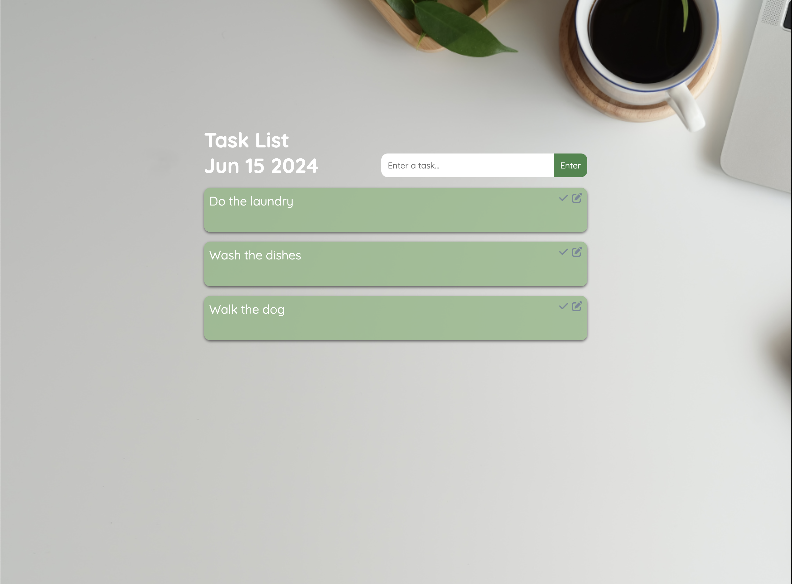

# Task Management Application: <a href="https://666d69f856f07cad8b1b0482--dashing-dasik-a8b086.netlify.app/" target="_blank">Visit Here</a>

</a>
This is a Task Management Application that allows users to input tasks and display them in a list format with options to edit or delete each task. Tasks are stored locally using localStorage, ensuring persistence across page reloads. Key features include dynamic UI updates upon user actions (add, edit, delete tasks) and responsive design for mobile and desktop views.

## Tech used: 

## Optimizations

<li>Implement asynchronous data handling (e.g., AJAX) to update the UI dynamically without full page refreshes.</li>
<li>Add ARIA attributes and roles to enhance screen reader compatibility and keyboard navigation.</li>
<li>Validate user inputs and handle potential errors (e.g., empty tasks) with informative messages or UI cues.</li>
<li>Test and refine CSS media queries to improve layout consistency and usability on different devices</li>

## Lessons Learned:

<li>Leveraging localStorage for storing application data locally across sessions.</li>
<li>Managing user interactions through event listeners efficiently.
</li>
<li>Updating the DOM dynamically based on user actions.</li>
<li>Using CSS Flexbox for responsive and flexible layout designs.</li>
<li>Designing intuitive user interfaces with interactive elements (buttons, input fields).</li>
